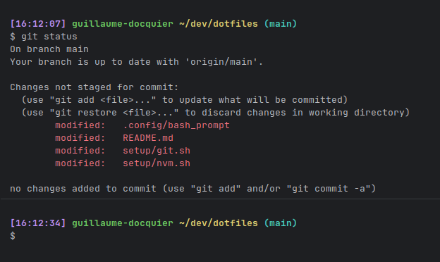

# Guillaume’s dotfiles

Inspired by [Mathias’s dotfiles](https://github.com/mathiasbynens/dotfiles?tab=readme-ov-file#mathiass-dotfiles)


# Installation

```bash
source ./setup/all.sh

# Git credentials
# Not in the repository, to prevent people from accidentally committing under my name
git config --global user.name "Your name"
git config --global user.email "your.email@mail.com"
```

# TODO

- install without git
- don't install if already present
- prompt for info (name, email, paths, etc)
- bashrc bootstrap
- ssh keys generation
- displaylink for ubuntu?
- vim
- git
- htop
- docker
